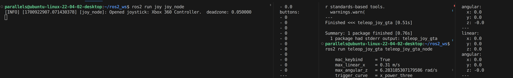
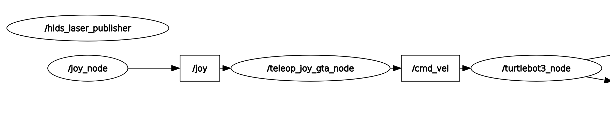

# About
ros 2 package, tested on ROS2 Humble ARM64

This is just a fun project to control a robot. I played a lot of Grand Theft Auto(GTA) growing up and it's just muscle memory for me to control anything with wheels like this.

Left trigger is break or reverse
Right trigger is forward
Left stick is steering (for differential drive robot this will rotate the robot)

Subcribed to : /Joy

Publish to : /cmd_vel

# Feature

- Output only `linear_x` and `angular_z` for diferential drive

# Limitations

- Currently only support the Xbox One Controller button inputs

- TODO: ros launch file to execute both joy and teleop_joy_gta

# Configuration

Adjust these parameter to your liking
if you are using Ubuntu natively not on MacOS then set `mac_keybind` to `False`

```python
# When using Ubuntu on Mac --> True
mac_keybind = True

# Set top speed
max_linear_x = float(0.31) #m/s
max_angular_z = float(2 * math.pi) #rad/s

# Set speed curve
trigger_curve = trigger_curve_dict["x_power_three"]
```

# Installation

1. git clone this repo into src of your ros workspace
1. `colcon build`


# Usage




## Run

Terminal 1:
```shell
# Run joy to accept controller and publish it as /joy
ros2 run joy joy_node
```

Terminal 2:
```shell
ros2 run teleop_joy_gta teleop_joy_gta_node
```

## Inspect joy msg

Check button index
`ros2 topic echo /joy`

Check lantency??
`ros2 topic hz /joy`

## Inspect cmd_vel msg

Check speed
`ros2 topic echo /cmd_vel`

`ros2 topic hz /cmd_vel`

# Contribution

if you wanna contribute your controller configuration, please great an issue and considering contributing. Thank you and have run roboting.
